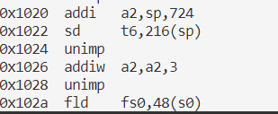
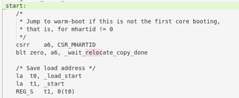
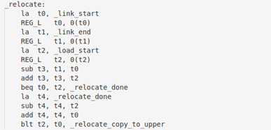
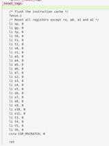
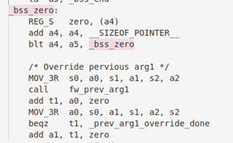
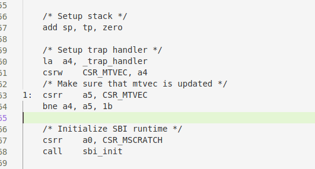
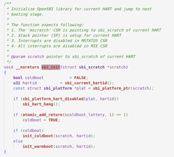

# Lab0.5
RISC-V 硬件加电后的几条指令位于QEMU源码中的reset_vec中
```
uint32_t reset_vec[8] = {
    0x00000297,                  /* 1:  auipc  t0, %pcrel_hi(dtb) */
    0x02028593,                  /*     addi   a1, t0, %pcrel_lo(1b) */
    0xf1402573,                  /*     csrr   a0, mhartid  */
#if defined(TARGET_RISCV32)
    0x0182a283,                  /*     lw     t0, 24(t0) */
#elif defined(TARGET_RISCV64)
    0x0182b283,                  /*     ld     t0, 24(t0) */
#endif
    0x00028067,                  /*     jr     t0 */
    0x00000000,
    memmap[VIRT_DRAM].base,      /* start: .dword memmap[VIRT_DRAM].base */
    0x00000000,
                                    /* dtb: */
};
```

主要完成工作是向寄存器a0、a1中传入HartID等参数，跳转到OpenSBI加载内核  
实验练习过程如下：

## 加电指令
使用make gdb调试，在跳转至bootloader所在地址0x8000之前，执行以下代码，与reset_vec中的代码一致  
```
0x1000:      auipc   t0,0x0
0x1004:      addi    a1,t0,32
0x1008:      csrr    a0,mhartid
0x100c:      ld      t0,24(t0)
0x1010:      jr      t0
0x1014:      unimp
0x1016:      unimp
0x1018:      unimp
0x101a:      0x8000
0x101c:      unimp
```

代码详细解释如下：  
- auipc t,0x9	# add upper immediate to pc  
将一个20位的立即数加上PC寄存器的值，并将结果存储到目标寄存器中  
在RISC-V中，全局变量的地址是由PC寄存器和偏移量组成的。偏移量通常是一个20位的立即数，而PC寄存器则指向当前指令的地址  
使用AUIPC指令将偏移量加到PC寄存器的高20位上，从而得到全局变量的地址，为后面的ld t0,24(t0)加载变量作准备  
- addi a1,t0,32  
a1通常是用于参数传递的寄存器，将它的值赋值为t0的值加上32也就是4096+32=0x1020，故a1指向地址0x1020  
利用命令layout asm查看汇编代码，发现地址**0x1020处不是数据而是指令**:  
  
说明a1被赋值为一个函数的入口地址，而这个函数在0x1020处
- 0x1008 csrr a0,mhartid
control and status register read，a0用于参数传递，从mhartid寄存器中读取值，该寄存器包含了当前Hart(硬件线程)的ID，进一步使用命令info r mhartid查看它的值，结果为0
- 0x100c 1d,t0,24(t0)
load doubleword，这个数据的地址是t0+24 = 4096+24= 0x1080，这里储存的数据可以从上面的代码段读出，为0x80000000  
查询源码，发现这就是memmap[VIRT_DRAM].base的值
- 0x1010 jr,t0
跳转到t0寄存器中保存的地址，也就是刚刚取出的0x80000000，继续执行指令

## OpenSBI
为了理解0x80000000至0x80200000汇编代码所做工作，我们查看了OpenSBI的源代码，大致执行流程如下：  

### 在fw_base.S进行底层初始化
1. 检查mhartid的值  

2. 进行代码重定位（判断_load_start与_start函数是否一致），根据加载地址和链接地址之间的差异，将程序从加载地址移到链接地址，以确保程序在正确的位置运行  

3. 清除寄存器的值  

4. 清除bss段  

5. 设置栈指针（预留栈空间），读取设备树中的设备信息，设备树重定位，底层初始化结束，执行sbi_init，进行正式的初始化程序  

### 设备初始化
Sbi_init.c中的sbi_init函数进行初始化OpenSBI库以准备当前的HART，启动处理器核心  



