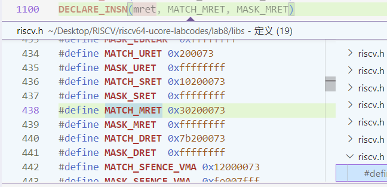

# Lab1


## 练习1
``` bash
la sp, bootstacktop
```

load address，将栈指针（sp）的值设置为 bootstacktop 标签的地址  
而bootstacktop是声明好的栈顶的位置，故操作的目的是初始化栈  

``` bash
tail kern_init
```

tail 尾调用指令，与普通的 jal 指令不同，主要特点是在调用函数之前，将当前函数的返回地址设置为目标函数的地址  
在执行 tail kern_init 后，不会在当前函数的返回地址寄存器 ra 中保存返回地址，而是直接跳转到 kern_init 函数（不再返回，不占用栈）

## 练习2  
在 kern/trap/trap.c 中编写如下代码，每触发一次`IRQ_S_TIMER`事件，就先判断触发次数是否达到`TICK_NUM`次，如果达到就调用`print_ticks()`打印，将num的次数加一。如果num达到10也就是打印了10次，就调用`sbi_shutdown()`关机：  
```C
clock_set_next_event();
if(++ticks % TICK_NUM == 0) {
    print_ticks();
    num++;
    if(num==10){
        sbi_shutdown();
    }
}
```

在定时器中断处理的过程中，kern/init/init.c先调用kern/driver/clock.c中的`clock_init()`对计时器进行初始化  
在初始化计时器的过程中同时调用`clock_set_next_event()`，设置下一个定时器中断的时间点  
当经过`timebase`个时钟周期后，触发`IRQ_S_TIMER`事件，此时trapentry.S接收到此事件，调用_alltraps函数，先保存上下文，然后调用kern/trap/trap.c的`trap()`处理中断  
通过`trap()`进入`trap_dispatch()`，最后进入`interrupt_handler()`函数中执行上述代码中的处理过程。

## Challenge1
> 描述ucore中中处理中断异常的流程（从异常的产生开始）

当指令执行时发生中断（时钟中断之类）或异常（除以0之类）时，由于实验中采用的是采用Direct 模式, 也就是只有一个中断处理程序。所以此时会固定的跳转到初始化stvec时设置好的处理程序地址，也即`__alltraps`处，进行上下文保存，然后跳转到中断处理函数`trap()`根据scause寄存器进行trap的分配与解决，解决完毕返回到`__trapret`恢复保存的寄存器，也即上下文，通过sret跳转回原程序。

> mov a0，sp的目的是什么？

栈顶指针作为参数放入a0，传入`trap`函数，栈上正是所有寄存器的值  

> SAVE_ALL中寄寄存器保存在栈中的位置是什么确定的？

struct结构体连续存储，地址连续，从栈顶/首地址指针通过偏移寻址  

> 对于任何中断，__alltraps 中都需要保存所有寄存器吗？

x0->Hard-wired zero永远保存的是0，也可以不用保存/恢复  
 

## Challenge2
>  csrw sscratch, sp；csrrw s0, sscratch, x0 实现了什么操作，目的是什么？

`csrw sscratch, sp` 是将sp栈指针寄存器保存到sscratch寄存器，sscratch本身为0  
`csrrw s0, sscratch, x0` 是先将sscratch寄存器保存到s0，再将x0保存到sscratch寄存器，而x0是零寄存器，也就是将sscratch清零，恢复为原来的值  
两操作的目的是为了通过sscratch寄存器保存发生中断或异常时sp的值，以便在处理完毕后对其进行恢复  

> save all 里面保存了 stval scause 这些 csr，而在 restore all 里面却不还原它们？那这样 store 的意义何在呢？

处理时会用到`stval`，`scause `这些寄存器，`stval`用于记录重要的辅助信息，`scause`用于记录中断原因，这些在处理时都会用到，所以要保存，而处理完毕后不必再使用，所以不需要恢复


## Challenge3
内联汇编触发断点：
```C
asm volatile("ebreak");
asm volatile("ebreak");
while (1){}
```

异常处理返回以后，需要跳转到下一条指令执行，进而需要更新epc寄存器，否则会陷入死循环，不断触发异常  
经过debug，我们得出了异常指令的长度：`ebreak`指令占用2个字节，`mret`指令占用4个字节  


进一步在riscv.h中查找两条指令定义，得到其机器码如下，与debug的结果一致：  



分发处理异常：

```C
case CAUSE_ILLEGAL_INSTRUCTION:
    cprintf("Exception type: Illegal instruction\n");
    cprintf("Illegal instruction caught at 0x%x\n",tf->epc);
    tf->epc+=4;
    break;
case CAUSE_BREAKPOINT:
    cprintf("Exception type: breakpoint\n");
    cprintf("ebreak caught at 0x%x\n",tf->epc);
    tf->epc+=2;
    break;
```

## 知识点分析
### 重要知识点
1. 中断与异常发生时，上下文切换  
   对应于OS原理的进程切换
   操作系统在终止当前进程时，需要实现上下文切换：保存和恢复寄存器，对于一些特殊寄存器如sp，还需特别处理  
   在中断处理这里，还需保存epc等CSR；所有的上下文构成`trapframe`放在栈上，一个struct连续存储；恢复的时候根据需要，有些CSR可以不用恢复  
2. 中断与异常处理后epc的设置
   课程目前还没有介绍到相关的知识，但处理后epc的更新需要十分小心
   异常是执行一条指令时发生了错误，该条指令并未执行，处理完以后要根据异常的类型进行调整epc  
   中断是由外设信号产生，与CPU是异步的，CPU正常执行代码，处理完中断后只需接着正常执行即可
3. 一次中断的执行流  
   在产生一个中断或者异常后，由于Direct模式，stevc跳转到`__alltraps`保存上下文，接着进入`trap()`按照中断类型进行分发处理，完成处理以后回到`__alltraps`恢复上下文，最后`sret`回到原执行流  
   
