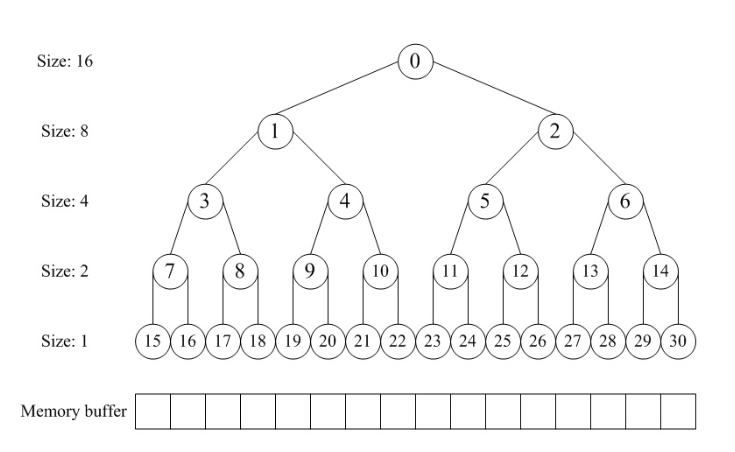

# Lab2

## 理解 first-fit 连续物理内存分配算法（思考题）

> first-fit 连续物理内存分配算法作为物理内存分配一个很基础的方法，需要同学们理解它的实现过程。请大家仔细阅读实验手册的教程并结合 kern/mm/default_pmm.c 中的相关代码，认真分析 default_init，default_init_memmap，default_alloc_pages，default_free_pages 等相关函数，并描述程序在进行物理内存分配的过程以及各个函数的作用。请在实验报告中简要说明你的设计实现过程。  
first fit 算法是否有进一步的改进空间？

ucore中采用面向对象编程的思想，将物理内存管理的内容抽象成若干个特定的函数，并以结构体pmm_manager作为物理内存管理器封装各个内存管理函数的指针  
这样在管理物理内存时只需调用结构体内封装的函数，从而可将内存管理功能的具体实现与系统中其他部分隔离开。pmm_manager中保存的函数及其功能如下所述：

```c
struct pmm_manager {
    const char *name;                                 //物理内存管理器的名称
    void (*init)(void);                               //物理内存管理器初始化
    void (*init_memmap)(struct Page *base, size_t n); //初始化空闲页，
    struct Page *(*alloc_pages)(size_t n);            //申请分配指定数量的物理页
    void (*free_pages)(struct Page *base, size_t n);  //申请释放若干指定物理页
    size_t (*nr_free_pages)(void);                    //查询当前空闲页总数
    void (*check)(void);                              //检查物理内存管理器的正确性
};
```

另外，使用了一些标志位来标识一个页的分配情况以及保留情况:

```c
#define PG_reserved                 0
#define PG_property                 1

struct Page {
    int ref;                        // page frame's reference counter
    uint32_t flags;                 //描述物理页帧状态的标志位
    unsigned int property;          //只在空闲块内第一页中用于记录该块中页数，其他页都是0
    list_entry_t page_link;         //空闲物理内存块双向链表
};
```

reserved位表示是否将页保留给操作系统，property位表示页的分配情况当为1时是空闲块开头，0时为分配块或者空闲块的块身。  
default_pmm.c中实现的几个函数的作用如下：

- default_init：初始化pmm
- default_init_memmap：初始化内存映射
- default_alloc_pages：申请多个页
- default_free_pages: 申请释放多个页

以下是具体介绍  
**default_init：**

```c
free_area_t free_area; /*allocate blank memory for the doublely linked list*/

#define free_list (free_area.free_list)
#define nr_free (free_area.nr_free)

static void
default_init(void) {
    list_init(&free_list);
    nr_free = 0;
}
```

default_init函数比较简单，作用为初始化双向链表，将空闲页总数nr_free初始化为0。  
**default_init_memmap：**

```c
static void 
default_init_memmap(struct Page *base, size_t n) {   
    assert(n > 0);
    struct Page *p = base;
    for (; p != base + n; p ++) {
        assert(PageReserved(p));
        p->flags = p->property = 0;
        set_page_ref(p, 0);
    }
    base->property = n;
    SetPageProperty(base);
    nr_free += n;
        if (list_empty(&free_list)) {
        list_add(&free_list, &(base->page_link));
    } else {
        list_entry_t* le = &free_list;
        while ((le = list_next(le)) != &free_list) {
            struct Page* page = le2page(le, page_link);
            if (base < page) {
                list_add_before(le, &(base->page_link));
                break;
            } else if (list_next(le) == &free_list) { //添加到末尾的情况
                list_add(le, &(base->page_link));
            }
        }
    }
}
```

遍历base以及n所确定的Page检查页面是否被内核reserved，如果reserved说明该页面是可用的，否则说明以及分初始化了，或者是非法页。  
接下来，将块内各个页的flags置为0以标记物理页帧有效，property成员置零。使用SetPageProperty宏置PG_Property标志位来标记空闲块首页，将首页property置为块内总页数，然后将全局总页数nr_free加上块内总页数，并用page_link这个双链表结点指针集合将块首页连接到空闲块链表里。  
最后一步分为两种情况：如果freelist中无空闲块，就直接加入；如果有空闲块，就要考虑加入的顺序，让小地址的块排在前面。

**default_alloc_pages(size_t n)：**

```c
static struct Page *
default_alloc_pages(size_t n) {
    assert(n > 0);
    if (n > nr_free) {
        return NULL;
    }
    struct Page *page = NULL;
    list_entry_t *le = &free_list;
    while ((le = list_next(le)) != &free_list) {
        struct Page *p = le2page(le, page_link);
        if (p->property >= n) {
            page = p;
            break;
        }
    }
    if (page != NULL) {
        list_entry_t* prev = list_prev(&(page->page_link));
        list_del(&(page->page_link));
        if (page->property > n) {
            struct Page *p = page + n; //操作的还是实际上地址处的page
            p->property = page->property - n;
            SetPageProperty(p);
            list_add(prev, &(p->page_link));
        }
        nr_free -= n;
        ClearPageProperty(page);
    }
    return page;
}
```

分配页的函数default_alloc_pages从起始位置开始顺序搜索空闲块链表  
找到第一个页数不小于所申请页数n的块（p->property >= n），如果这个块所对应的页数正好等于申请的页数（p->property == n），则可直接分配；  
如果块页数比申请的页数多（p->property > n）就要将块分裂，将找到的页分配出去，分裂出来的页链接到freelist中，分配完成后重新计算全局空闲页数；  
若遍历整个空闲链表仍找不到足够大的块，则返回NULL表示分配失败。

**default_free_pages(struct Page *base, size_t n)：**

```c
static void
default_free_pages(struct Page *base, size_t n) {
    assert(n > 0);
    struct Page *p = base;
    for (; p != base + n; p ++) {
        assert(!PageReserved(p) && !PageProperty(p));
        p->flags = 0;
        set_page_ref(p, 0);
    }
    base->property = n;
    SetPageProperty(base);
    nr_free += n;

    if (list_empty(&free_list)) {
        list_add(&free_list, &(base->page_link));
    } else {
        list_entry_t* le = &free_list;
        while ((le = list_next(le)) != &free_list) {
            struct Page* page = le2page(le, page_link);
            if (base < page) {
                list_add_before(le, &(base->page_link));
                break;
            } else if (list_next(le) == &free_list) {
                list_add(le, &(base->page_link));
            }
        }
    }

    list_entry_t* le = list_prev(&(base->page_link));
    if (le != &free_list) {
        p = le2page(le, page_link);
        if (p + p->property == base) {
            p->property += base->property;
            ClearPageProperty(base);
            list_del(&(base->page_link));
            base = p;
        }
    }

    le = list_next(&(base->page_link));
    if (le != &free_list) {
        p = le2page(le, page_link);
        if (base + base->property == p) {
            base->property += p->property;
            ClearPageProperty(p);
            list_del(&(p->page_link));
        }
    }
}
```

释放页的函数default_free_pages根据参数提供的块基址，遍历freelist找到待插入位置，插入这些页  
然后将property置为块内页数，使用SetPageProperty宏置PG_Property标志位来标记空闲块首页，将首页property置为块内总页数  
将全局总页数nr_free加上块内总页数，并用page_link这个双链表结点指针集合将块首页连接到空闲块链表里

最后一步分为两种情况：freelist中的空闲块，正好与加入的块相接，就删除freelist中原有的块，将这些块合并成一个大块，整体加入到freelist中。

> 你的 first fit 算法是否有进一步的改进空间？

first fit算法的优点是实现简单，缺点是会产生很多小的空闲块，导致内存碎片化严重。  
可以考虑加入碎片化的内存整理算法，将多个小的空闲块合并成一个大的空闲块，从而减少内存碎片化。

## best fit的实现

best_fit_pmm.c中要实现的几个函数功能与default_pmm.c大致相同：

- best_fit_init：初始化pmm
- best_fit_init_memmap：初始化内存映射
- best_fit_alloc_pages：申请多个页
- best_fit_free_pages: 申请释放多个页

其中best_fit_init、best_fit_init_memmap以及best_fit_free_pages函数的实现与default_pmm.c中的函数完全相同，可以参考其中的代码即可。

**best_fit_alloc_pages:**

对于best_fit_alloc_pages函数，只需使用同default_alloc_pages函数中类似的方法，遍历freelist链表，找到满足要求的最小页并用指针记录即可。  
代码如下：

```c
while ((le = list_next(le)) != &free_list) {
    struct Page *p = le2page(le, page_link);
    if (p->property >= n && p->property < min_size) {
        min_size = p->property;
        page = p;
    }
}
```

> 你的 best fit 算法是否有进一步的改进空间？

best fit算法同first fit算法的特点相似，实现简单，但会产生很多小的空闲块  
所以也可以考虑加入碎片化的内存整理算法，将多个小的空闲块合并成一个大的空闲块

## challenge1
> Buddy System 算法把系统中的可用存储空间划分为存储块 (Block) 来进行管理, 每个存储块的大小必须是 2 的 n 次幂 (Pow(2, n)), 即 1, 2, 4, 8, 16, 32, 64, 128…  
参考[伙伴分配器的一个极简实现](https://github.com/wuwenbin/buddy2)，在 ucore 中实现 buddy system 分配算法，要求有比较充分的测试用例说明实现的正确性，需要有设计文档。

伙伴分配的实质就是一种特殊的“分离适配”，即将内存按2的幂进行划分，相当于分离出若干个块大小一致的空闲链表，搜索该链表并给出同需求最佳匹配的大小。其优点是可以快速搜索合并（O(logN)时间复杂度）以及低外部碎片（与最佳适配best-fit的优点类似）；其缺点是内部碎片，因为按2的幂划分块，如果碰上66单位大小，那么必须划分128单位大小的块。Buddy System的内存管理机制如下。


  
**分配内存：**  
寻找大小合适的内存块，找到一个刚好大于所需内存大小的2的次幂大小的空闲内存块，如果没有将更大的内存块对半分离。


**释放内存：**  
1. 寻找相邻的块，看其是否释放了。  
2. 如果相邻块也释放了，合并这两个块，重复上述步骤直到遇上未释放的相邻块，或者达到最高上限（即所有内存都释放了）。  

### buddy_system实现1 -- 朱世豪实现
[buddy1](src/buddy1.md)

### buddy_system实现2 -- 唐明昊实现
[buddy2](src/buddy2.md)

### buddy_system实现3 -- 姜永韩实现
[buddy3](src/buddy3.md)

### buddy_system测试

**测试用例设计如下：**  
1. 首先申请 p0 p1 p2 p3，其大小为 70 35 257 63，
从前向后分配的块及其大小，以及对应的页如下所示：  
|64+64|64|64|256|512|
|----|----|----|----|----|
|p0|p1|p3|空|p2|   

2. 然后释放p0、p1、p3，这时候前512个页已经空了。  

3. 然后我们申请 p4 p5，其大小为 255 255，那么这时候系统的内存空间是这样的：  
| 256 | 256 | 256 |
|----|----|----|
| p4 | p5 | p2 | 


4. 最后释放所有page，通过断言机制assert()判定不同块的首地址。
```C
static void basic_check(void){
    struct Page *p0, *p1,*p2;
    p0 = p1 = NULL;
    p2=NULL;
    struct Page *p3, *p4,*p5;
    assert((p0 = alloc_page()) != NULL);
    assert((p1 = alloc_page()) != NULL);
    assert((p2 = alloc_page()) != NULL);
    free_page(p0);
    free_page(p1);
    free_page(p2);
    
    p0=alloc_pages(70);
    p1=alloc_pages(35);
    assert((p1-p0)==128);  // 通过分配策略可知两个page相差128
    
    p2=alloc_pages(257);
    cprintf("p2 %p\n",p2);
    assert((p2-p1)==384);  // p2和p1应当相差256+128
    
    p3=alloc_pages(63);
    cprintf("p3 %p\n",p3);
     assert((p3-p1)==64);  // p3和p1相差64
    
    free_pages(p0,70);    
    cprintf("free p0!\n");
    free_pages(p1,35);
    cprintf("free p1!\n");
    free_pages(p3,63);    
    cprintf("free p3!\n");
    
    p4=alloc_pages(255);
    cprintf("p4 %p\n",p4);
    assert((p2-p4)==512);  // p2和p4差512
    
    p5=alloc_pages(255);
    cprintf("p5 %p\n",p5);
    assert((p5-p4)==256);  // p5和p6应该差256
        free_pages(p2,257);    
    cprintf("free p2!\n");
        free_pages(p4,255);    
    cprintf("free p4!\n"); 
            free_pages(p5,255);    
    cprintf("free p5!\n");   
    cprintf("CHECK DONE!\n") ;
```


## challenge2
### 80386时代

- 早期由CPU主动探测：向它认为可能有内存的地址写55aa序列，接着扫描读取，如果读回来的仍是55aa，说明此处内存可用，更新内存表格。
- 后续转由BIOS来进行内存探测，系统调用int15，也是通过写入55aa，读取来判断内存是否可用。
- 再后来主板厂商开始与内存厂商约定，使用SPD芯片来记录内存信息：   
   1. BIOS扫描内存插槽确定内存模块。
   2. 接着BIOS读取SPD芯片的信息来获取内存信息并将其存储在内存表中。  
   3. BIOS将保存了内存模块起始地址、大小等属性的内存表传递给操作系统。

### RISCV
一种路线：  
1. 不依赖BIOS，由硬件开发者编写device tree source code，描述硬件配置包括内存布局。  
2. 该文件通常为树形结构，不同节点描述不同的硬件组件。  
3. 使用DT compiler将其编译成device tree blob二进制格式。  
4. Bootloader将DTB加载到内存某个特定位置，或将位置传递给内核。  
5. 内核通过解析DTB来获取硬件信息，包括内存布局。

查看qemu源码，发现在pc-bios文件夹下有[dts文件](src/bamboo.dts)：可以看到QEMU虚拟化了AMCC Bamboo硬件平台，该设备树文件描述了CPU、内存、中断控制器、PCI控制器、以太网接口等硬件信息。  

另一种路线：  
- SBI提供sbi_query_memory接口，类似于BIOS提供的内存检测功能。

