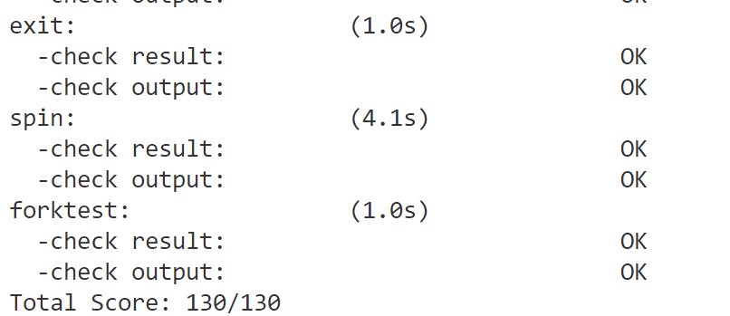
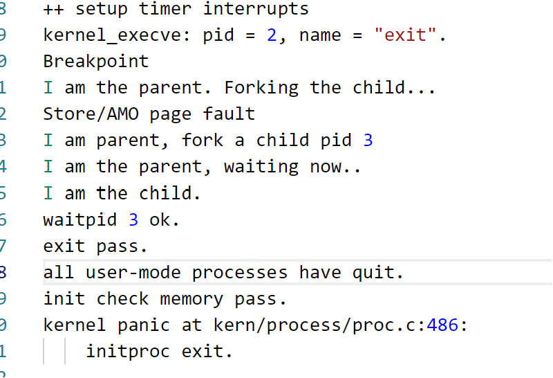

# lab5 <!-- omit in toc -->

- [练习 1: 加载应用程序并执行](#练习-1-加载应用程序并执行)
  - [请简要描述这个用户态进程被ucore选择占用CPU执行（RUNNING态）到具体执行应用程序第一条指令的整个经过。](#请简要描述这个用户态进程被ucore选择占用cpu执行running态到具体执行应用程序第一条指令的整个经过)
- [练习 2: 父进程复制自己的内存空间给子进程](#练习-2-父进程复制自己的内存空间给子进程)
  - [如何设计实现 Copy on Write 机制？给出概要设计](#如何设计实现-copy-on-write-机制给出概要设计)
- [练习 3: 分析fork/exec/wait/exit和系统调用的实现](#练习-3-分析forkexecwaitexit和系统调用的实现)
  - [函数分析](#函数分析)
  - [函数执行流程](#函数执行流程)
  - [请给出 ucore 中一个用户态进程的执行状态生命周期图。](#请给出-ucore-中一个用户态进程的执行状态生命周期图)
- [扩展练习 Challenge](#扩展练习-challenge)
  - [实现 Copy on Write （COW）机制](#实现-copy-on-write-cow机制)
    - [代码实现](#代码实现)
    - [测试结果](#测试结果)
  - [用户程序是何时被预先加载到内存中的？与常用操作系统加载的区别，原因是什么？](#用户程序是何时被预先加载到内存中的与常用操作系统加载的区别原因是什么)
- [知识点分析](#知识点分析)
  - [重要知识点](#重要知识点)
  - [额外知识点](#额外知识点)


## 练习 1: 加载应用程序并执行
根据提示，设置应用进程的中断帧，使得进程后续能够正常返回用户态执行。具体的代码如下：
```C
    // 设置进程的中断帧，执行sret返回用户态，按系统调用路径原路返回：ebreak？
    //(6) setup trapframe for user environment
    struct trapframe *tf = current->tf;
    // Keep sstatus
    uintptr_t sstatus = tf->status;
    memset(tf, 0, sizeof(struct trapframe));
    /* LAB5:EXERCISE1 YOUR CODE
     * should set tf->gpr.sp, tf->epc, tf->status
     * NOTICE: If we set trapframe correctly, then the user level process can return to USER MODE from kernel. So
     *          tf->gpr.sp should be user stack top (the value of sp)
     *          tf->epc should be entry point of user program (the value of sepc)
     *          tf->status should be appropriate for user program (the value of sstatus)
     *          hint: check meaning of SPP, SPIE in SSTATUS, use them by SSTATUS_SPP, SSTATUS_SPIE(defined in risv.h)
     */
    tf->gpr.sp = USTACKTOP;  // 用户栈顶
    tf->epc = elf->e_entry;  // 用户程序入口
    tf->status = (read_csr(sstatus) & ~SSTATUS_SPP & ~SSTATUS_SPIE);  // 用户态
```

### 请简要描述这个用户态进程被ucore选择占用CPU执行（RUNNING态）到具体执行应用程序第一条指令的整个经过。
1. 当init进程将用户进程创建完毕后，进入`do_wait`阶段。接着ucore会调度选择用户进程执行，进入`user_main`。  
2. `user_main`调用`kernel_exe`，在内核态触发`ebreak`中断。目的是通过与`trap`协作，调用`sys_exec`，完成进程加载，并最后通过中断返回回到用户态。
3. `sys_exec`调用`do_execve`：回收当前进程的内存空间，然后调用`load_icode`，根据elf文件的信息，将用户程序加载到内存中。
4. 如实验指导手册所写，`load_icode`会执行一系列操作为用户进程建立能够运行的用户环境，报告建立`mm`、建立页目录表、分配各个段、设置用户栈、设置中断帧等。
5. `load_icode`最后一步设置了用户栈，`epc`和`status`。中断处理完毕后，会通过`trapret`回到用户态，执行用户进程`entry_point`处的指令。


## 练习 2: 父进程复制自己的内存空间给子进程
`do_fork`会调用`copy_range`完成将父进程的内存空间复制给子进程的工作。  
需要补充的代码很简单，参照注释首先使用`page2kva`拿到两个page的虚拟地址，然后调用`memcpy`将父进程的内存空间复制给子进程，最后通过`page_insert`在子进程的页表中建立映射关系。

```C
    /* LAB5:EXERCISE2 YOUR CODE
        * replicate content of page to npage, build the map of phy addr of
        * nage with the linear addr start
        *
        * Some Useful MACROs and DEFINEs, you can use them in below
        * implementation.
        * MACROs or Functions:
        *    page2kva(struct Page *page): return the kernel vritual addr of
        * memory which page managed (SEE pmm.h)
        *    page_insert: build the map of phy addr of an Page with the
        * linear addr la
        *    memcpy: typical memory copy function
        *
        * (1) find src_kvaddr: the kernel virtual address of page
        * (2) find dst_kvaddr: the kernel virtual address of npage
        * (3) memory copy from src_kvaddr to dst_kvaddr, size is PGSIZE
        * (4) build the map of phy addr of  nage with the linear addr start
        */
    void* src_kvaddr = page2kva(page);
    void* dst_kvaddr = page2kva(npage);
    memcpy(dst_kvaddr, src_kvaddr, PGSIZE);
    ret = page_insert(to, npage, start, perm);
```

### 如何设计实现 Copy on Write 机制？给出概要设计
1. 要实现Copy on Write机制，在fork时，首先将父进程的内存空间设置为只读。  
2. 接着让子进程共享父进程的内存空间，需要做的就是让子进程的虚拟地址映射到父进程的物理页。  
3. 当进程修改共享页面时，ucore会触发`page_fault`中断，此时需要判断是否是写一个只读页面。  
4. 如果是，则需要将页面复制一份，然后修改子进程的页表，建立新的映射关系，使得子进程的内存空间与父进程的内存空间分离。  
5. 最后还需查看原来共享的物理页是否只有一个进程在使用，如果是，则恢复原来的读写权限。


## 练习 3: 分析fork/exec/wait/exit和系统调用的实现

用户态程序的fork/exec/wait/exit系统调用到最后实际调用的是kern/syscall/syscall.c中的sys_fork/sys_exec/sys_exit/sys_wait，故下面首先对于这四个函数进行分析。

### 函数分析

**sys_fork函数**

下面是具体的`sys_fork`函数：

```c
static int
sys_fork(uint64_t arg[]) {
    struct trapframe *tf = current->tf;
    uintptr_t stack = tf->gpr.sp;
    return do_fork(0, stack, tf);
}
```

可见`sys_fork`函数将当前进程的中断帧以及中断帧中esp寄存器值作为参数传给`do_fork`，由`do_fork`完成具体的fork工作。

`do_fork`的作用是创建当前内核线程的一个副本，它们的执行上下文、代码、数据都一样，但是存储位置不同。  
实际需要”fork”的东西就是 stack 和 trapframe。在`do_fork`中给新内核线程分配资源，并且复制原进程的状态即可，具体的代码见`proc.c`。

本次实验在第一步中加入了assert语句，确保当前进程不处于等待状态，在第五步中由于还要维护兄弟指针等变量，需要在插入hash_list后调用set_links函数来设置这些指针。其他方面的实现上，与lab4中相同，此处不再赘述。

**sys_exec函数**

下面是具体的`sys_exec`函数：

```c
static int
sys_exec(uint64_t arg[]) {
    const char *name = (const char *)arg[0];
    size_t len = (size_t)arg[1];
    unsigned char *binary = (unsigned char *)arg[2];
    size_t size = (size_t)arg[3];
    return do_execve(name, len, binary, size);
}
```

可见`sys_fork`函数从参数中得到进程名，名字长度，程序首地址以及程序的大小信息，将他们作为参数传给`do_execve`从而完成让程序执行另一个程序的操作。


`do_execve`首先判断自身如果是用户进程，就回收自身所占用户空间：
```c
    if (mm != NULL) {  // 用户进程
        cputs("mm != NULL");
        // 设置页表为内核空间页表，接下来在内核空间执行
        lcr3(boot_cr3);     // 这里是启动一个进程为什么要回收内核的页表项？
        // 判断 mm 的引用计数
        if (mm_count_dec(mm) == 0) {
            // 回收当前进程的内存空间？
            exit_mmap(mm);
            put_pgdir(mm);
            mm_destroy(mm);
            // 重新分配内存
        }
        current->mm = NULL;
    }
```

然后调用`load_icode`，用新的程序覆盖内存空间，从而形成一个执行新程序的新进程，`load_icode`部分的分析可以参考练习一中的讲解。

**sys_wait函数** 

下面是具体的sys_wait函数：

```c
sys_wait(uint64_t arg[]) {
    int pid = (int)arg[0];
    int *store = (int *)arg[1];
    return do_wait(pid, store);
}
```
`sys_wait`函数用于进程等待指定的子进程的退出并回收其资源，通过传入的参数获得`pid`和`store`，`pid`为需要等待退出的子进程id，`store`为子进程的退出状态。最后将这两个参数传给`do_wait`函数，完成具体的等待工作。

`do_wait`函数的具体实现如下,`do_wait`函数首先判断传入的参数是否合法，然后根据传入的`pid`来找到对应的子进程，若`pid=0`，则等待任意子进程退出。如果子进程已经退出，则回收其资源，否则将当前进程设置为睡眠状态，等待子进程退出，然后通过`schedule`函数调度其他进程执行。
```c
    struct mm_struct *mm = current->mm;
    if (code_store != NULL) {
        if (!user_mem_check(mm, (uintptr_t)code_store, sizeof(int), 1)) {
            return -E_INVAL;
        }
    }
    struct proc_struct *proc;
    bool intr_flag, haskid;
repeat:
    haskid = 0;
    if (pid != 0) {
        proc = find_proc(pid);  // 找到指定pid的进程
        if (proc != NULL && proc->parent == current) {  // 找到了且是当前进程的子进程
            haskid = 1;
            if (proc->state == PROC_ZOMBIE) {  // 子进程已经退出
                goto found;
            }
        }
    }
    else {  // pid == 0，等待任意子进程退出
        proc = current->cptr;
        for (; proc != NULL; proc = proc->optr) {  // 遍历子进程链表
            haskid = 1;
            if (proc->state == PROC_ZOMBIE) {
                goto found;
            }
        }
    }
    if (haskid) {  // 子进程还没退出，当前进程睡眠等待
        current->state = PROC_SLEEPING;
        current->wait_state = WT_CHILD;
        schedule();
        if (current->flags & PF_EXITING) {
            do_exit(-E_KILLED);
        }
        goto repeat;
    }
```

在`do_wait`函数中，通过子进程的`exit_code`获得其退出状态，然后保存到`code_store`中，释放的资源主要是子进程的内核栈和`proc_struct`。
```c
    if (code_store != NULL) {
        *code_store = proc->exit_code;
    }
    local_intr_save(intr_flag);
    {   // 回收子进程的资源
        unhash_proc(proc);
        remove_links(proc);
    }
    local_intr_restore(intr_flag);
    // 释放子进程的内存空间
    put_kstack(proc);
    kfree(proc);
```


**sys_exit函数**  

`sys_exit`函数的具体实现如下:
```c
static int
sys_exit(uint64_t arg[]) {
    int error_code = (int)arg[0];
    return do_exit(error_code);
}
```
`sys_exit`函数用于进程主动退出，通过传入的参数获得`error_code`，然后将这个参数传给`do_exit`函数完成退出，并将`error_code`保存到`proc->exit_code`，以便发送到父进程，让其得以获得该进程的退出状态。

`do_exit`函数首先检查当前进程的内存管理结构`mm`，如果不为`NULL`，表示其为一个用户进程，需要将页表设置为内核空间页表，表示在内核空间工作。  
然后判断`mm`的引用计数，若当前用户空间只有该进程使用，则调用`exit_mmap`释放`mm`中的空间；然后调用`put_pgdir`释放页目录表，最后调用`mm_destroy`释放`mm`。  
接下来将当前进程的状态设置为`PROC_ZOMBIE`，表示该进程已经退出。  
接着遍历当前进程的子进程，插入到`initproc`的子进程链表中，如果子进程已经退出，则唤醒`initproc`来回收其资源。  
最后调用`schedule`函数，调度其他进程执行。


### 函数执行流程

fork/exec/wait/exit 函数的实现都是借助user/libs/ulib.c中的库来实现的，以fork为例，其执行的流程如下：
``` c
// user/libs/ulib.c中
fork(void) {
    return sys_fork();
}

// user/libs/syscall.c中
int
sys_fork(void) {
  return syscall(SYS_fork);
}
``` 
可以看到用户可以通过`user/libs/ulib.c`中的fork函数调用sys_fork函数，从而将系统调用交给syscall函数来处理：

```c
// user/libs/syscall.c中
static inline int
syscall(int64_t num, ...) {
    va_list ap;
    va_start(ap, num);
    uint64_t a[MAX_ARGS];
    int i, ret;
    for (i = 0; i < MAX_ARGS; i ++) {  // 依次取出参数
        a[i] = va_arg(ap, uint64_t);
    }
    va_end(ap);

    asm volatile (
        "ld a0, %1\n"
        "ld a1, %2\n"
        "ld a2, %3\n"
        "ld a3, %4\n"
        "ld a4, %5\n"
    	"ld a5, %6\n"
        "ecall\n"
        "sd a0, %0"
        : "=m" (ret)
        : "m"(num), "m"(a[0]), "m"(a[1]), "m"(a[2]), "m"(a[3]), "m"(a[4])
        :"memory");
    return ret;
}
```

在syscall函数中依次读取传入的参数后，通过调用ecall触发异常，陷入到内核态

```c
// kern/trap/trap.c的exception_handler函数
case CAUSE_USER_ECALL:
    //cprintf("Environment call from U-mode\n");
    // 处理用户态调用syscall
    tf->epc += 4;  // 指向下一条指令
    syscall();	// kern/syscall/syscall.c中的syscall
    break;
```

在trap中经过trap_dispatch时，通过读取cause寄存器确定了这是由于用户态调用ecall触发的中断，于是调用`kern/syscall/syscall.c`中的syscall函数（内核态执行系统调用的函数）来对系统调用进行处理

```c
// kern/syscall/syscall.c中
static int (*syscalls[])(uint64_t arg[]) = {
    [SYS_exit]              sys_exit,
    [SYS_fork]              sys_fork,
    [SYS_wait]              sys_wait,
    [SYS_exec]              sys_exec,
    [SYS_yield]             sys_yield,
    [SYS_kill]              sys_kill,
    [SYS_getpid]            sys_getpid,
    [SYS_putc]              sys_putc,
    [SYS_pgdir]             sys_pgdir,
};

void
syscall(void) {
    struct trapframe *tf = current->tf;
    uint64_t arg[5];
    int num = tf->gpr.a0;  // a0寄存器存放系统调用号
    if (num >= 0 && num < NUM_SYSCALLS) {  // 防止数组越界
        if (syscalls[num] != NULL) {
            // 取出系统调用参数，转发给对于的系统调用函数处理
            arg[0] = tf->gpr.a1;
            arg[1] = tf->gpr.a2;
            arg[2] = tf->gpr.a3;
            arg[3] = tf->gpr.a4;
            arg[4] = tf->gpr.a5;
            tf->gpr.a0 = syscalls[num](arg);
            return ;
        }
    }
    print_trapframe(tf);
    panic("undefined syscall %d, pid = %d, name = %s.\n",
            num, current->pid, current->name);
}
```

该函数从中断帧中取出系统调用的参数，通过传入的num来把系统调用分配到对应的函数。

这一分配过程则是通过函数指针数组syscalls来实现，这里用到了**指定初始化器**的语法，例如当传入的num是SYS_kill，那么syscalls[num]就是sys_kill的函数指针，从而实现了对于系统调用的分配。

接着，对应的系统调用便可正常执行，故可以总结fork/exec/wait/exit的执行流程如下：

1. 用户通过user/libs/ulib.c进行系统调用（fork/exec/wait/exit函数）
2. 转到user/libs/syscall.c中的sys_fork/sys_exec/sys_exit/sys_wait
3. 转到user/libs/syscall.c中的syscall，调用ecall
4. 陷入到trap，通过exception_handler处理
5. 调用kern/syscall/syscall.c中的syscall
6. 通过num不同分配到具体的函数进行处理（kern/syscall/syscall.c中的sys_fork/sys_exec/sys_exit/sys_wait）

### 请给出 ucore 中一个用户态进程的执行状态生命周期图。

```
  (alloc_proc)            (proc_init/wakeup_proc)
---------------> PROC_UNINIT -----------------> PROC_RUNNABLE
                                                    |
                                                    |
                                                    | (proc_run)
                                                    |
                 (do_wait/do_sleep/ try_free_pages) V    (do_exit)
  PROC_SLEEPING <--------------------------------RUNNING------------->PROC_ZOMBIE
        |                                           A
        |                                           | 
        |                                           |
        |                                           |
        +-------------------------------------------+
                        (wakeup_proc)      
```


## 扩展练习 Challenge

### 实现 Copy on Write （COW）机制
#### 代码实现
首先，在fork时将父进程的空间设为只读，再将子进程的虚拟地址空间映射到父进程的物理页，二者共享内存空间。  
代码如下，根据`share`的值来判断是否需要共享内存空间。如果需要，则通过`page_insert`将子进程的虚拟地址空间映射到父进程的物理页，否则，将父进程的内存空间复制给子进程。  
```C
    if(share){
        // COW，共享，初始两边都设置为只读
        page_insert(from, page, start, perm & (~PTE_W));
        ret = page_insert(to, page, start, perm & (~PTE_W));
    }
    else{
        struct Page *npage = alloc_page();
        assert(npage != NULL);
        void* src_kvaddr = page2kva(page);
        void* dst_kvaddr = page2kva(npage);
        memcpy(dst_kvaddr, src_kvaddr, PGSIZE);
        ret = page_insert(to, npage, start, perm);
    }
```

接着就是修改`do_pgfault`函数，当发生缺页中断时，判断是否是写一个只读页面。  
如果是，则需要将页面复制一份，然后修改子进程的页表，建立新的映射关系，使得子进程的内存空间与父进程的内存空间分离。  
另外还需查看原来共享的物理页是否只有一个进程在使用，如果是，需恢复原来的读写权限。  
```C
    // Copy on Write，发生写不可写页面错误时，tf->cause == 0xf
    else if((*ptep & PTE_V) && (error_code == 0xf)) {
        struct Page *page = pte2page(*ptep);
        if(page_ref(page) == 1) {
            // 该页面只有一个引用，直接修改权限
            page_insert(mm->pgdir, page, addr, perm);
        }
        else {
            // 该页面有多个引用，需要复制页面
            struct Page *npage = alloc_page();
            assert(npage != NULL);
            memcpy(page2kva(npage), page2kva(page), PGSIZE);
            if(page_insert(mm->pgdir, npage, addr, perm) != 0) {
                cprintf("page_insert in do_pgfault failed\n");
                goto failed;
            }
        }
    }
```

#### 测试结果
由于时间所限，没有设置专门的测试用例以及模拟指导书中提出的错误场景。  
只是设置为Copy On Write机制后，运行了`make grade`，测试结果如下：
  

可以看到，能够通过所有测试用例。  
查看exit.c的输出日志，可以看到，当进程修改共享页面时，触发了缺页中断，进行了`Copy On Write`操作复制了页面，用户程序正常执行。




### 用户程序是何时被预先加载到内存中的？与常用操作系统加载的区别，原因是什么？

本次实验把用户准备的二进制程序编译到了内核镜像中。  
由于在本次实验中文件系统还没实现，于是想要执行一个编译好的二进制程序，就要将二进制程序和内核一同编译，把可执行程序链接到内核中，也就是在内存中创建了一个大空间，将这个文件以二进制形式保存在了这一片内存区域中。  

常用操作系统是通过以下步骤来加载用户程序的：  
1. 操作系统根据路径找到对应的程序，检测程序的头部，找到代码段和数据段的位置，以及程序的入口点。
2. 操作系统为程序分配内存空间，将程序的各个段加载到内存中，并进行地址重定位，使得程序能够正确地访问自己的数据和代码。
3. 操作系统将执行权移交给程序的入口点，开始执行用户程序。

常用操作系统是在用户程序需要执行时被加载到内存，而本次实验，用户程序是在内核启动时就被加载到内存中，原因在于文件系统尚未实现，无法将可执行文件从硬盘加载到内存。


## 知识点分析
### 重要知识点
- 特权转换：在RISCV中，用户程序通过调用`syscall`函数，触发`ecall`中断，从而陷入到内核态，完成系统调用，通过`sret`指令返回用户态。

- 应用程序加载：通过`sys_exec`系统调用，利用`load_icode`将用户程序加载到内存中，然后通过`trapret`函数返回用户态，执行用户程序。


### 额外知识点

本次实验只是创建了一个用户进程，对于用户进程间的同步和通信，以及多个进程为竞争资源死锁的问题。

- 进程同步：进程同步是指多个进程之间按照一定的顺序执行，以确保数据的一致性和正确性。进程同步的方法互斥锁，信号量，临界区等方式，通过控制进程对共享资源的访问，从而实现进程同步。

- 死锁：死锁是多个进程因竞争有限的系统资源而被永久阻塞的一种状态。当每个进程都持有一些资源并等待其他进程释放其资源时，就可能发生死锁。死锁的发生是由于进程之间的相互等待，导致它们都无法继续执行。死锁的常用的解决策略有：预防，避免，检测恢复，忽略。
